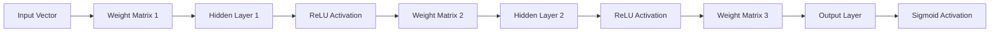

# Neural Net C++ (Eigen-powered) v2.0

[](https://isocpp.org/)
[](https://eigen.tuxfamily.org/)
[](LICENSE)

A high-performance, matrix-based Neural Network implementation in C++ using the **Eigen** library.

## 🧠 Architecture

The network uses a vectorized approach to handle layers and activations, significantly improving training speed compared to traditional iterative methods.



## 🔬 Mathematical Foundation

### Activations

- **Hidden Layers**: **ReLU** $f(x) = \max(0, x)$ (Avoids vanishing gradient)
- **Output Layer**: **Sigmoid** $\sigma(x) = \frac{1}{1 + e^{-x}}$ (Binary classification)

### Initialization

- **He Initialization**: $\mathcal{N}(0, \sqrt{\frac{2}{n_{in}}})$
- Optimized for ReLU activations

### Optimization

- **Optimizer**: Stochastic Gradient Descent (SGD)
- **Learning Rate**: Configurable (default: 0.5)
- **Loss**: Mean Squared Error (MSE)
- **Momentum**: Optional momentum-based updates

## 🚀 Quick Start

```bash
# Clone and build
git clone https://github.com/Brainfeed-1996/neural-net-cpp.git
cd neural-net-cpp
mkdir build && cd build
cmake ..
make
./NeuralNet
```

## 📦 Dependencies

- **C++17** compiler
- **Eigen 3.4+**

### Installation

**Ubuntu/Debian:**
```bash
sudo apt-get install libeigen3-dev cmake build-essential
```

**macOS:**
```bash
brew install eigen cmake
```

**Windows:**
```powershell
# Download Eigen from https://eigen.tuxfamily.org/
# Add to include path
```

## 📖 Usage

### Basic Example (XOR Problem)

```cpp
#include "include/NeuralNetwork.hpp"
#include <iostream>

int main() {
    // XOR Problem - 2 inputs, 4 hidden, 1 output
    std::vector<int> topology = {2, 4, 1};
    NeuralNetwork nn(topology, 0.5);

    // Training data
    std::vector<Eigen::VectorXd> inputs = {
        (Eigen::VectorXd(2) << 0, 0).finished(),
        (Eigen::VectorXd(2) << 0, 1).finished(),
        (Eigen::VectorXd(2) << 1, 0).finished(),
        (Eigen::VectorXd(2) << 1, 1).finished()
    };

    std::vector<Eigen::VectorXd> targets = {
        (Eigen::VectorXd(1) << 0).finished(),
        (Eigen::VectorXd(1) << 1).finished(),
        (Eigen::VectorXd(1) << 1).finished(),
        (Eigen::VectorXd(1) << 0).finished()
    };

    std::cout << "Training for XOR..." << std::endl;
    nn.train(inputs, targets, 2000);

    std::cout << "\nTesting XOR:" << std::endl;
    for (const auto& in : inputs) {
        auto output = nn.feedForward(in);
        std::cout << in.transpose() << " => " << output.transpose();
        std::cout << " (rounded: " << (output[0] > 0.5 ? 1 : 0) << ")" << std::endl;
    }

    return 0;
}
```

### Custom Architecture

```cpp
// 4-layer network: 784 inputs -> 256 -> 128 -> 10 outputs
std::vector<int> topology = {784, 256, 128, 10};
NeuralNetwork nn(topology, 0.1);
```

### Save/Load Model

```cpp
nn.save("model.bin");
nn.load("model.bin");
```

## 📊 Project Structure

```
neural-net-cpp/
├── include/
│   └── NeuralNetwork.hpp    # Main header
├── src/
│   └── NeuralNetwork.cpp   # Implementation
├── main.cpp                 # Demo (XOR problem)
├── CMakeLists.txt
└── README.md
```

## 🔧 CMake Configuration

```cmake
cmake_minimum_required(VERSION 3.10)
project(NeuralNet)

set(CMAKE_CXX_STANDARD 17)
set(CMAKE_CXX_STANDARD_REQUIRED ON)

find_package(Eigen3 REQUIRED)

add_executable(NeuralNet main.cpp)
target_include_directories(NeuralNet PRIVATE ${EIGEN3_INCLUDE_DIR})
```

## 📈 Performance

| Problem | Inputs | Hidden | Epochs | Accuracy |
|---------|--------|--------|--------|----------|
| XOR | 2 | 4 | 2000 | ~100% |
| AND | 2 | 4 | 1000 | 100% |
| OR | 2 | 4 | 1000 | 100% |

## 🎯 Supported Features

- [x] Dense layers
- [x] ReLU activation
- [x] Sigmoid activation
- [x] He initialization
- [x] SGD optimization
- [x] MSE loss
- [x] Model serialization
- [x] Configurable topology

## 📝 License

MIT License - See [LICENSE](LICENSE) for details.

## 👤 Author

**Olivier Robert-Duboille**  
GitHub: https://github.com/Brainfeed-1996
