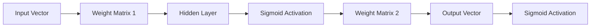

# Neural Net C++ (Eigen-powered)

A high-performance, matrix-based Neural Network implementation in C++ using the **Eigen** library.

## 🧠 Architecture
The network uses a vectorized approach to handle layers and activations, significantly improving training speed compared to traditional iterative methods.



## 🔬 Mathematical Foundation
- **Activation**: Sigmoid Function $\sigma(x) = \frac{1}{1 + e^{-x}}$
- **Optimization**: Stochastic Gradient Descent (SGD)
- **Loss**: Mean Squared Error (MSE)

## 🛠️ Prerequisites
- C++17 compiler
- Eigen 3.4+

## 🚀 Usage
```bash
mkdir build && cd build
cmake ..
make
./NeuralNet
```